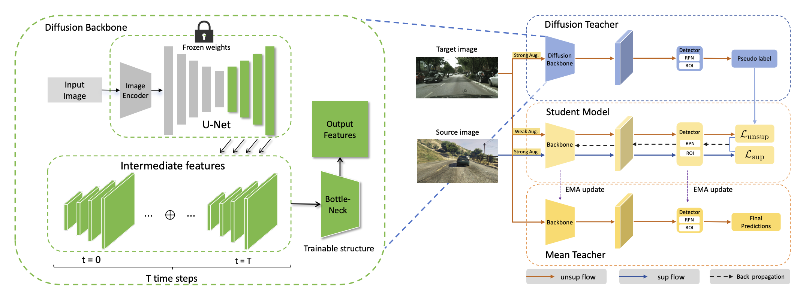
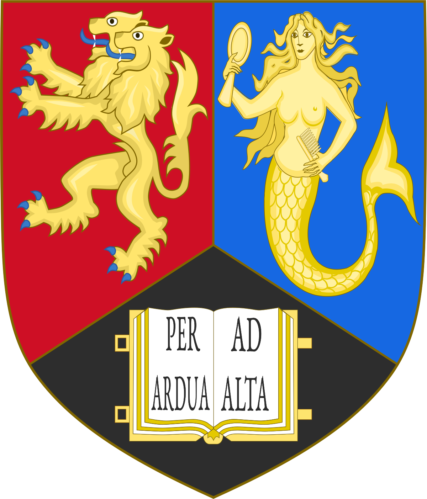

# About Me

Hi, there! I am Yuxiang Ji (姬煜翔).
I currently study as a Ph.D. student in Xiamen University, supervised by Prof Liaoni Wu, and Prof [Yancheng You](https://scholar.google.com/citations?user=pz8Zmp0AAAAJ&hl=en).
I am interested with computer vision and multimodal research for UAVs, especially the generation and utilization of synthetic images.
Previously, I worked as an AI engineer at [Huawei Camera group](https://www.huawei.com/en/).
I obtained my Master degree in Artificial Intelligence and Machine Learning from the University of Birmingham under the guidance of Prof [Shuo Wang](https://phd-shuowang.weebly.com/).

  <a href="./assets/pdf/CV_YuxiangJi.pdf">CV</a> &nbsp;/&nbsp;
  <a href="mailto:yuxiangji@stu.xmu.edu.cn"><i class="fa-solid fa-envelope"></i></a> &nbsp;/&nbsp;
  <a href="https://scholar.google.com/citations?hl=zh-CN&user=XmODrKRH5H4C"><i class="fa-brands fa-google-scholar"></i></a> &nbsp;/&nbsp;
  <a href="https://github.com/Yux1angJi"><i class="fa-brands fa-github"></i></a>

 

# Publications

<!-- 
 -->

    
    

        <h4>Game4Loc: A UAV Geo-Localization Benchmark from Game Data</h4>
        
<strong>Yuxiang Ji*</strong>, Boyong He*, Zhuoyue Tan, Liaoni Wu  

        
<em>AAAI</em>, <a><strong>Oral Presentation</strong></a>, 2025

        
<a href="https://yux1angji.github.io/game4loc">[Project]</a> | <a href="https://arxiv.org/abs/2409.16925">[Arxiv]</a> | <a href="https://github.com/Yux1angJi/GTA-UAV">[Github]</a> | <a href="https://arxiv.org/pdf/2409.16925">[PDF]</a> | <a href="assets/pdf/Game4Loc_supp.pdf">[Supp]</a> 

    

    
    

        <h4>Diffusion Features to Bridge Domain Gap for Semantic Segmentation</h4>
        
<strong>Yuxiang Ji*</strong>, Boyong He*, Chenyuan Qu, Zhuoyue Tan, Chuan Qin, Liaoni Wu

        
<em>ICASSP</em>, 2025

        
<a href="https://arxiv.org/abs/2406.00777">[Arxiv]</a> | <a href="https://github.com/Yux1angJi/DIFF">[Github]</a> | <a href="assets/pdf/diff.pdf">[PDF]</a>

    

    
    

        <h4>Diffusion Domain Teacher: Diffusion Guided Domain Adaptive Object Detector</h4>
        
Boyong He*, <strong>Yuxiang Ji*</strong>, Zhuoyue Tan, Liaoni Wu

        
<em>ACM MM</em>, 2024

        
<a href="assets/pdf/Diffusion_Domain_Teacher.pdf">[PDF]</a>

    

<!-- 
 -->

# Education

<table>
    <tr>
        <td style="vertical-align: middle; padding-right: 30px;"></td>
        <td style="vertical-align: middle;">
            <a href="http://www.birmingham.ac.uk" target="_blank" style="text-decoration: underline;"><strong>University of Birmingham</strong></a> 
            <strong>M.S.</strong> in  Artificial Intelligence and Machine Learning with Distinction, <em>2021 - 2022</em>
        </td>
    </tr>
    <tr>
        <td style="vertical-align: middle; padding-right: 30px;"></td>
        <td style="vertical-align: middle;">
            <a href="https://www.nwu.edu.cn/" target="_blank" style="text-decoration: underline;"><strong>Northwest University</strong></a> 
            <strong>B.Eng.</strong> in Electronic Information Science and Technology with Honors, <em>2017 - 2021</em>
        </td>
    </tr>
</table>

 

# Work Experience

<table>
    <tr>
        <td style="vertical-align: middle; padding-right: 30px; padding-bottom: 20px;"></td>
        <td style="vertical-align: middle; ">
            <a href="https://www.huawei.com/en/" target="_blank" style="text-decoration: underline;"><strong>Huawei</strong></a> 
            AI Engineer, <i>Nov 2022 - Aug 2023</i> 
            Camera AI algorithm, model compression
        </td>
    </tr>
    <tr>
        <td style="vertical-align: middle; padding-right: 30px;"></td>
        <td style="vertical-align: middle;">
            <a href="https://www.bytedance.com/en/" target="_blank" style="text-decoration: underline;"><strong>ByteDance</strong></a> 
            R&D Intern, <i>Jun 2020 - Jan 2021</i> 
            Back-end development, big data
        </td>
    </tr>
</table>

 

# Honors and Awards

2021 May: 🥈Silver Medal in The 2020 ICPC Asia Yinchuan Regional Contest  
2020 Nov: 🥈Silver Medal in The 2020 CCPC, Mianyang Site  

 
